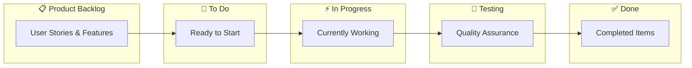
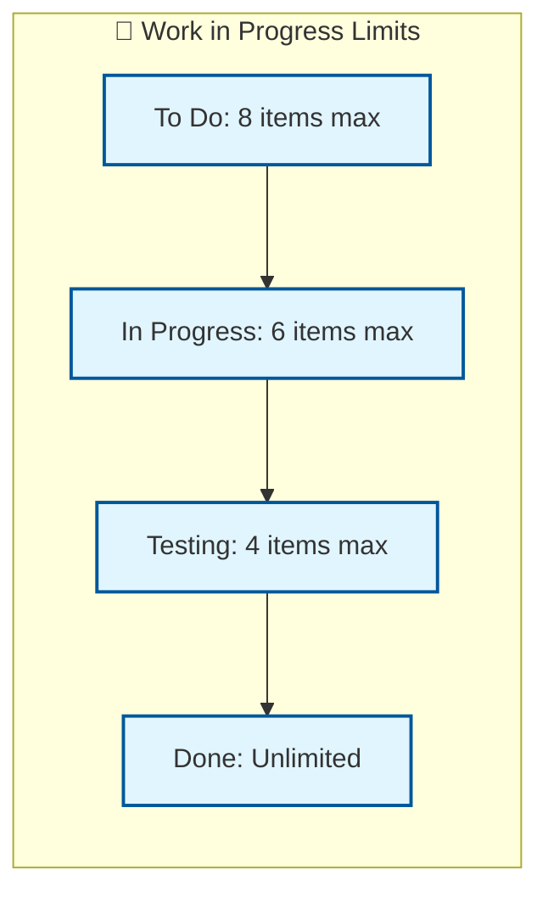
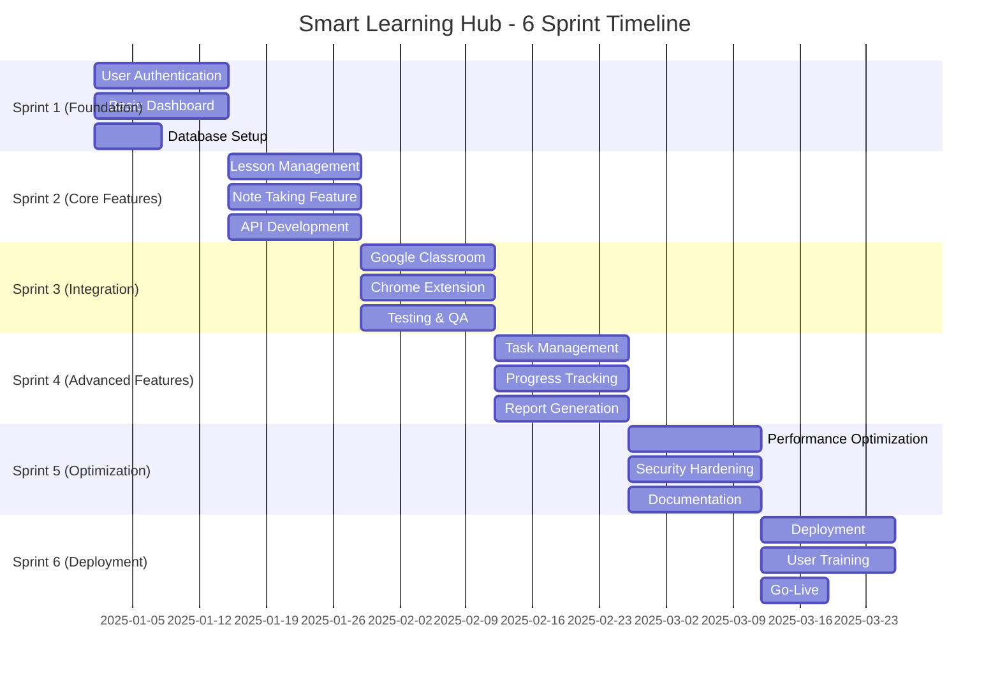
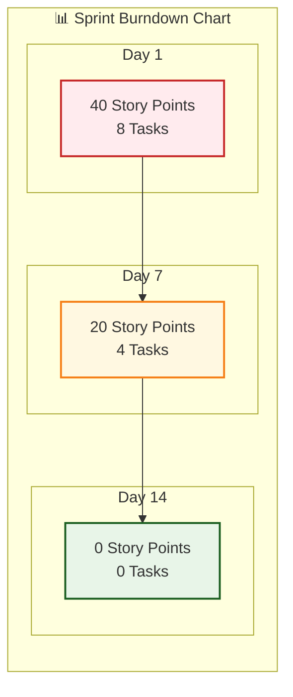

# **Smart Learning Hub - Agile Model Kanban Presentation**

## **🎯 Agile Model Kanban Overview**

### **What is Agile Model Kanban?**

**Kanban** เป็นวิธีการจัดการงานแบบ Agile ที่เน้น:
- **Visual Workflow** - เห็นการไหลของงานชัดเจน
- **WIP Limits** - จำกัดงานที่ทำพร้อมกัน
- **Continuous Improvement** - ปรับปรุงกระบวนการอย่างต่อเนื่อง
- **Pull System** - ดึงงานเมื่อพร้อม ไม่ผลักงาน

---

## **📋 Kanban Board Structure**

---

## **🔄 Smart Learning Hub Kanban Process**

### **1. Product Backlog**
- **User Authentication System**
- **Lesson Management Module**
- **Note Taking Feature**
- **Google Classroom Integration**
- **Chrome Extension Development**
- **Task Management System**
- **Progress Tracking**
- **Report Generation**

### **2. Sprint Planning**
- **Prioritize User Stories**
- **Estimate Story Points**
- **Define Sprint Goals**
- **Create Sprint Backlog**

### **3. Development Workflow**
- **To Do** → **In Progress** → **Testing** → **Done**
- **WIP Limits:** To Do (8), In Progress (6), Testing (4)

---

## **📊 Key Metrics & Performance**

### **Kanban Metrics**
- **Lead Time:** 5-7 วัน (จากเริ่มงานถึงเสร็จ)
- **Cycle Time:** 3-5 วัน (เวลาทำงานจริง)
- **Throughput:** 8-12 items ต่อ sprint
- **Velocity:** 25-35 story points ต่อ sprint

### **WIP Limits**

---

## **🔄 Sprint Timeline**

---

## **✅ Definition of Done**

### **Development Phase**
- [ ] Code Written
- [ ] Code Reviewed
- [ ] Unit Tests Pass
- [ ] Integration Tests Pass

### **Testing Phase**
- [ ] Manual Testing Done
- [ ] Automated Tests Added
- [ ] Performance Tested
- [ ] Security Tested

### **Documentation Phase**
- [ ] Code Documented
- [ ] API Documented
- [ ] User Guide Updated
- [ ] README Updated

### **Deployment Phase**
- [ ] Deployed to Staging
- [ ] Staging Tests Pass
- [ ] Deployed to Production
- [ ] Production Verified

---

## **📈 Sprint Burndown Progress**

---

## **🚨 Blockers & Dependencies**

### **Common Blockers**
- **External API Delays** - Google Classroom API
- **Third-party Integration Issues** - Chrome Extension
- **Testing Environment Setup** - CI/CD Pipeline
- **Code Review Bottlenecks** - Team Coordination

### **Risk Mitigation**
- **Backup Plans** - Alternative APIs
- **Parallel Development** - Independent Modules
- **Automated Testing** - Reduce Manual Effort
- **Code Review Guidelines** - Clear Standards

---

## **🔄 Continuous Improvement**

### **Sprint Retrospective**
- **What Went Well?** - Team Collaboration
- **What Could Be Better?** - Communication
- **Action Items** - Process Improvements
- **Next Sprint Goals** - Velocity Targets

### **Process Improvements**
- **Automated Testing** - เพิ่มประสิทธิภาพ
- **Code Review Guidelines** - ลด bottlenecks
- **Daily Standups** - ปรับปรุงการสื่อสาร
- **WIP Limits** - ปรับตามความเหมาะสม

---

## **📊 Success Metrics**

### **Team Performance**
- **Velocity:** 25-35 story points/sprint
- **Quality:** < 5% defect rate
- **Delivery:** 95% on-time delivery
- **Satisfaction:** > 4.5/5 team satisfaction

### **Product Metrics**
- **User Adoption:** 80% target users
- **Performance:** < 2s page load time
- **Uptime:** 99.9% availability
- **Security:** Zero critical vulnerabilities

---

## **🎯 Key Benefits of Kanban**

### **1. Visual Management**
- เห็นสถานะงานชัดเจน
- ระบุ bottlenecks ได้ง่าย
- ปรับปรุง workflow อย่างต่อเนื่อง

### **2. WIP Limits**
- ป้องกัน overloading
- เพิ่มคุณภาพงาน
- ลด lead time

### **3. Continuous Delivery**
- ปล่อย features บ่อยขึ้น
- รับ feedback เร็วขึ้น
- ปรับปรุงผลิตภัณฑ์ต่อเนื่อง

### **4. Team Collaboration**
- ทำงานร่วมกันอย่างมีประสิทธิภาพ
- แบ่งปันความรู้
- สร้างวัฒนธรรมการปรับปรุง

---

**สรุป:** Kanban ช่วยให้ Smart Learning Hub พัฒนาได้อย่างมีประสิทธิภาพ มีคุณภาพ และตรงตามความต้องการของผู้ใช้ โดยเน้นการปรับปรุงอย่างต่อเนื่องและการทำงานเป็นทีม 