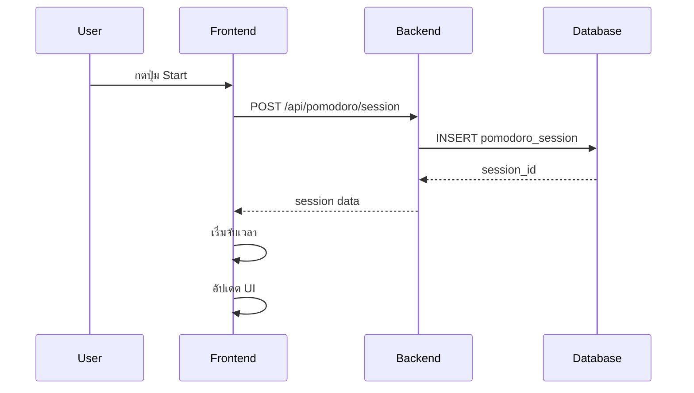
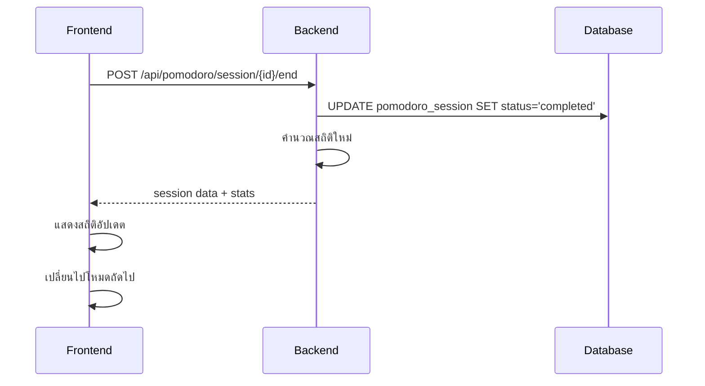

# 🍅 Pomodoro System Overview

## 📝 สรุประบบ Pomodoro
ระบบ Pomodoro Timer ใน PyProject เป็นระบบจัดการเวลาการเรียนและการทำงานโดยใช้เทคนิค Pomodoro Technique พร้อมกับการติดตาม Task และ Statistics

## 🏗️ สถาปัตยกรรมของระบบ

### 1. ฝั่ง Frontend (JavaScript)

#### **ไฟล์หลัก: `app/static/js/pomodoro.js`**
```
ขนาด: 1,694 บรรทัด
ประเภท: Single Page Application (SPA)
```

**โครงสร้างส่วนสำคัญ:**

##### **Global State Management**
```javascript
let pomodoroState = {
  mode: 'pomodoro',           // โหมดปัจจุบัน
  isRunning: false,           // สถานะการทำงาน
  timeLeft: 25 * 60,          // เวลาที่เหลือ (วินาที)
  currentSessionId: null,     // ID ของ session ปัจจุบัน
  cycle: 1,                   // รอบการทำงาน
  completedPomodoros: 0,      // จำนวน Pomodoro ที่เสร็จแล้ว
  tasks: [],                  // รายการ tasks
  settings: { ... },          // การตั้งค่า
  stats: { ... }              // สถิติการใช้งาน
}
```

##### **ฟังก์ชันหลัก:**
- **Timer Functions:**
  - `startTimer()` - เริ่มจับเวลา
  - `pauseTimer()` - หยุดชั่วคราว
  - `resetTimer()` - รีเซ็ตเวลา
  - `skipTimer()` - ข้ามไปรอบต่อไป

- **Session Management:**
  - `createSessionOnServer()` - สร้าง session ในฐานข้อมูล
  - `endSessionOnServer()` - จบ session
  - `interruptSessionInDatabase()` - ขัดจังหวะ session

- **Task Management:**
  - `createTaskOnServer()` - สร้าง task ใหม่
  - `updateTaskStatusOnServer()` - อัปเดตสถานะ task
  - `syncTasksFromServer()` - ซิงค์ tasks จากเซิร์ฟเวอร์

### 2. ฝั่ง Backend (Python/Flask)

#### **ไฟล์ Routes (API Endpoints)**

##### **A. `app/routes/pomodoro_routes.py`**
```python
# Basic Pomodoro API
@pomodoro_bp.route('/pomodoro/start', methods=['POST'])
@pomodoro_bp.route('/pomodoro/stop', methods=['POST'])
@pomodoro_bp.route('/pomodoro/status', methods=['GET'])
```

##### **B. `app/routes/pomodoro_session_routes.py`**
```python
# Advanced Session Management
@pomodoro_session_bp.route('', methods=['POST'])           # สร้าง session
@pomodoro_session_bp.route('/<session_id>', methods=['GET']) # ดู session
@pomodoro_session_bp.route('/user', methods=['GET'])        # ดู sessions ของ user
@pomodoro_session_bp.route('/<session_id>', methods=['PUT']) # อัปเดต session
@pomodoro_session_bp.route('/<session_id>/end', methods=['POST']) # จบ session
@pomodoro_session_bp.route('/active', methods=['GET'])      # ดู active session
```

##### **C. `app/routes/pomodoro_statistics_routes.py`**
```python
# Statistics & Analytics
@pomodoro_stats_bp.route('/daily', methods=['POST'])       # อัปเดตสถิติรายวัน
@pomodoro_stats_bp.route('/timer', methods=['GET'])        # สถิติ timer
@pomodoro_stats_bp.route('/daily-progress', methods=['GET']) # ความก้าวหน้ารายวัน
@pomodoro_stats_bp.route('/productivity', methods=['POST']) # รายงานประสิทธิภาพ
@pomodoro_stats_bp.route('/history', methods=['GET'])      # ประวัติการใช้งาน
```

#### **ไฟล์ Controllers**

##### **A. `app/controllers/pomodoro_session_views.py`**
```python
class PomodoroSessionViews:
    def create_session(self)      # สร้าง session ใหม่
    def get_session(self)         # ดูข้อมูล session
    def update_session(self)      # อัปเดต session
    def end_session(self)         # จบ session
    def get_user_sessions(self)   # ดู sessions ของ user
```

#### **ไฟล์ Services (Business Logic)**

##### **A. `app/services.py` - Class `PomodoroSessionService`**
```python
class PomodoroSessionService:
    def create_session(self, user_id, session_type, duration, ...)
    def get_session(self, session_id)
    def get_user_sessions(self, user_id)
    def update_session(self, session_id, data)
    def end_session(self, session_id, status)
    def get_active_session(self, user_id)
```

**ประเภท Session Types:**
- `focus` - เซสชันการมุ่งมั่นทำงาน (Pomodoro)
- `short_break` - พักสั้น
- `long_break` - พักยาว

#### **ไฟล์ Models (Database)**

##### **A. `app/models/pomodoro_session.py`**
```python
class PomodoroSessionModel(db.Model):
    id = db.Column(db.String(36), primary_key=True)
    user_id = db.Column(db.String(36), nullable=False)
    session_type = db.Column(db.String(20), nullable=False)
    duration = db.Column(db.Integer, nullable=False)
    start_time = db.Column(db.DateTime, nullable=False)
    end_time = db.Column(db.DateTime)
    actual_duration = db.Column(db.Integer)
    status = db.Column(db.String(20), default='active')
    is_completed = db.Column(db.Boolean, default=False)
    is_interrupted = db.Column(db.Boolean, default=False)
    # ... และ fields อื่นๆ
```

### 3. Database Schema

#### **Table: `pomodoro_session`**
```sql
CREATE TABLE pomodoro_session (
    id TEXT PRIMARY KEY,
    user_id TEXT NOT NULL,
    session_type TEXT NOT NULL,  -- 'focus', 'short_break', 'long_break'
    duration INTEGER NOT NULL,   -- ระยะเวลาที่ตั้งไว้ (นาที)
    start_time TIMESTAMP NOT NULL,
    end_time TIMESTAMP,
    actual_duration INTEGER,     -- ระยะเวลาที่ใช้จริง (นาที)
    status TEXT DEFAULT 'active', -- 'active', 'completed', 'interrupted'
    is_completed BOOLEAN DEFAULT FALSE,
    is_interrupted BOOLEAN DEFAULT FALSE,
    interruption_count INTEGER DEFAULT 0,
    lesson_id TEXT,
    task_id TEXT,
    task TEXT,                   -- ชื่อ task
    productivity_score INTEGER,
    mood_before TEXT,
    mood_after TEXT,
    focus_score INTEGER,
    energy_level INTEGER,
    notes TEXT,
    -- ... และ fields อื่นๆ
)
```

### 4. User Interface

#### **ไฟล์ Template: `app/templates/pomodoro_fragment.html`**

**ส่วนประกอบหลัก:**
- **Timer Display** - แสดงเวลาและความก้าวหน้า
- **Mode Tabs** - เลือกโหมด (Pomodoro/Short Break/Long Break)
- **Control Buttons** - Start/Pause/Reset/Skip
- **Task Management** - เพิ่ม/แก้ไข/ลบ tasks
- **Statistics Panel** - แสดงสถิติรายวันและรวม
- **Settings Dialog** - ตั้งค่าเวลาและการแจ้งเตือน

## 🔄 การทำงานของระบบ

### 1. การเริ่มต้น Pomodoro Session



### 2. การจับเวลา

```javascript
// Frontend Timer Logic
globalTimer = setInterval(() => {
  if (pomodoroState.isRunning) {
    const now = Date.now();
    const delta = Math.floor((now - lastTick) / 1000);
    
    if (delta >= 1) {
      pomodoroState.timeLeft = Math.max(0, pomodoroState.timeLeft - delta);
      lastTick = now;
      updateDisplay();
      
      if (pomodoroState.timeLeft === 0) {
        timerComplete();
      }
    }
  }
}, 1000);
```

### 3. การจบ Session



### 4. การจัดการ Tasks

#### **สร้าง Task:**
```javascript
// Frontend
async function createTaskOnServer(title) {
  const response = await fetch('/api/tasks', {
    method: 'POST',
    body: JSON.stringify({ title, task_type: 'focus' })
  });
}
```

#### **เชื่อมโยง Task กับ Session:**
```javascript
// เมื่อสร้าง session สามารถส่ง task_id ได้
const sessionData = {
  session_type: 'focus',
  duration: 25,
  task_id: selectedTaskId
};
```

## 📊 ระบบสถิติ

### 1. สถิติรายวัน (Daily Progress)
- จำนวน Pomodoro ที่เสร็จสิ้น
- เวลาโฟกัสทั้งหมด
- จำนวน Tasks ที่เสร็จ
- จำนวนครั้งที่พัก

### 2. สถิติรวม (Timer Stats)
- Pomodoro ทั้งหมด
- เวลาโฟกัสรวม
- Tasks ที่เสร็จทั้งหมด
- Streak (ต่อเนื่อง)

### 3. การคำนวณสถิติ

```python
# ใน PomodoroStatisticsService
def calculate_daily_statistics(self, user_id: str, date: date):
    sessions = PomodoroSessionModel.query.filter(
        PomodoroSessionModel.user_id == user_id,
        func.date(PomodoroSessionModel.start_time) == date
    ).all()
    
    completed_sessions = len([s for s in sessions if s.is_completed])
    focus_minutes = sum([s.actual_duration or s.duration 
                        for s in sessions if s.session_type == 'focus'])
    # ...
```

## 🔧 การตั้งค่า

### 1. การตั้งค่าเวลา
```javascript
settings: {
  pomodoro: 25,           // นาที
  shortBreak: 5,          // นาที  
  longBreak: 15,          // นาที
  longBreakInterval: 4,   // ทุก 4 รอบ
  autoStartBreaks: true,
  soundEnabled: true
}
```

### 2. การจัดเก็บ State
```javascript
// Local Storage
function saveState() {
  localStorage.setItem('pomodoroState', JSON.stringify(pomodoroState));
}

function loadState() {
  const saved = localStorage.getItem('pomodoroState');
  if (saved) {
    pomodoroState = { ...pomodoroState, ...JSON.parse(saved) };
  }
}
```

## 🔗 การเชื่อมโยงกับระบบอื่น

### 1. User Authentication
- ใช้ `@login_required` middleware
- รองรับ anonymous users
- เก็บ `user_id` ใน session

### 2. Task System
- เชื่อมโยงกับ Task API (`/api/tasks`)
- สามารถผูก Pomodoro session กับ task ได้
- อัปเดตสถานะ task เมื่อเสร็จ session

### 3. Lesson System
- สามารถเชื่อมโยงกับ lesson และ section ได้
- ใช้ `lesson_id` และ `section_id`

## 🚀 การพัฒนาต่อ

### 1. Features ที่มีอยู่แล้ว
- ✅ Basic Pomodoro Timer
- ✅ Task Management Integration
- ✅ Statistics & Analytics
- ✅ Session Persistence
- ✅ Multi-user Support

### 2. Features ที่สามารถพัฒนาต่อได้
- 🔄 Advanced Analytics Dashboard
- 🔄 Team Collaboration Features
- 🔄 Export/Import Data
- 🔄 Mobile App Integration
- 🔄 Calendar Integration

## 📝 สรุป

ระบบ Pomodoro ใน PyProject เป็นระบบที่สมบูรณ์แบบ ออกแบบตามหลัก Clean Architecture และมีการแยกความรับผิดชอบอย่างชัดเจน:

- **Frontend**: JavaScript SPA สำหรับ UI/UX
- **Backend**: Flask API สำหรับ Business Logic
- **Database**: SQLite สำหรับ Data Persistence
- **Integration**: เชื่อมโยงกับระบบ User, Task, และ Lesson

ระบบนี้สามารถรองรับการใช้งานจริงได้และมีความยืดหยุ่นในการพัฒนาต่อยอดในอนาคต