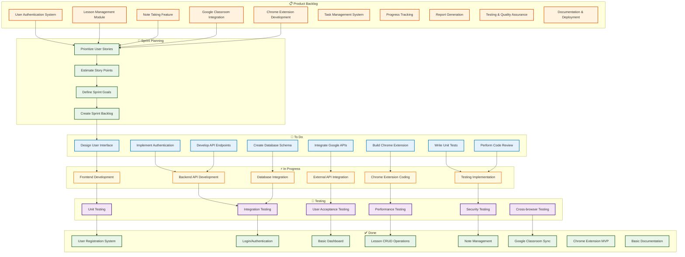
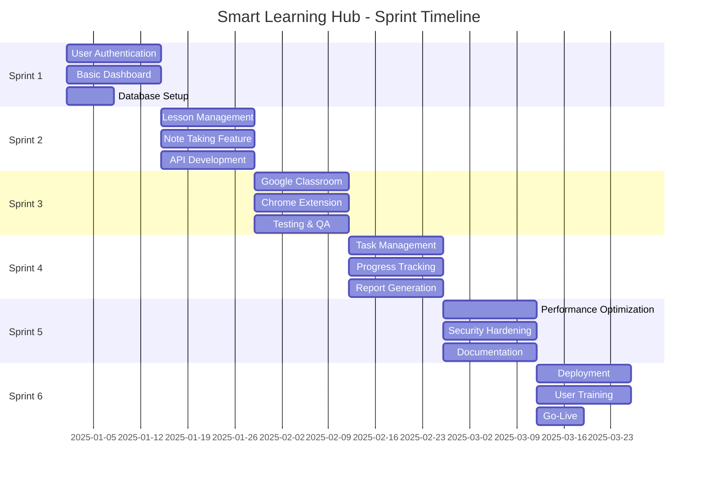
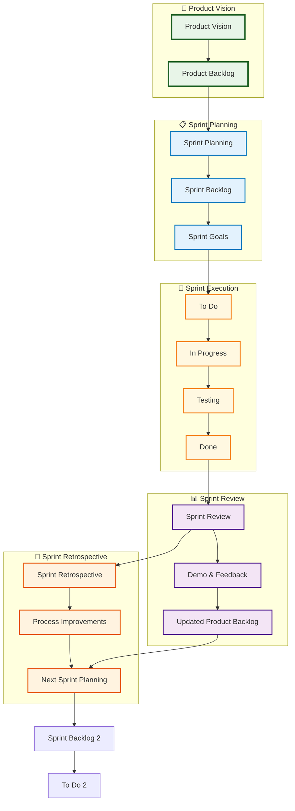
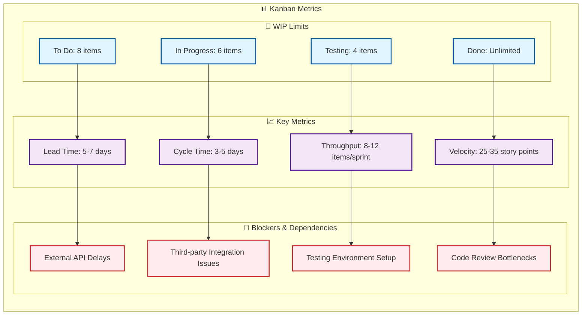
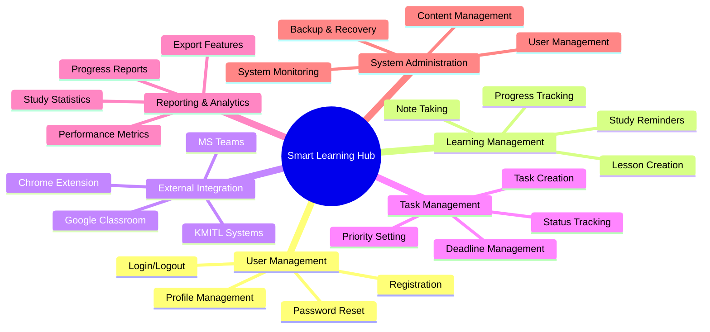
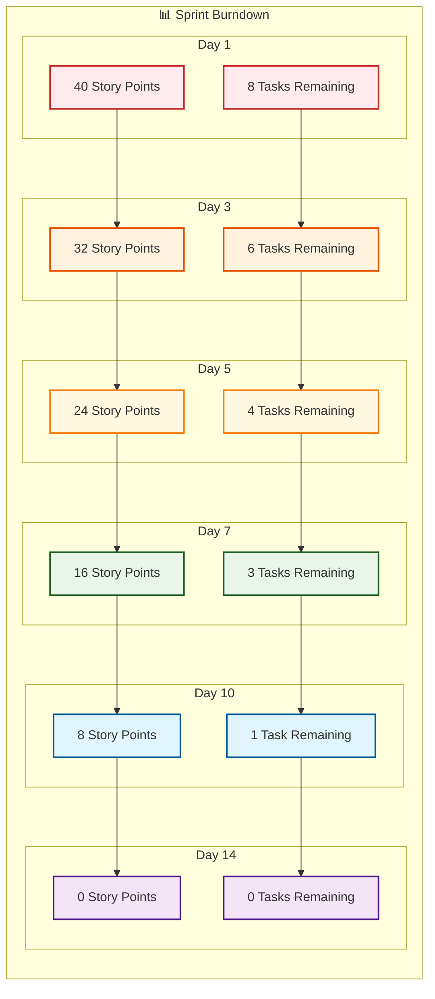

# **Smart Learning Hub - SDLC Agile Model Kanban Diagram**

## **Kanban Board Visualization**

### **Main Kanban Board**



## **Sprint Timeline View**



## **Agile Process Flow**



## **WIP Limits & Metrics**



## **User Story Mapping**



## **Definition of Done Checklist**

```mermaid
graph TD
    subgraph "✅ Definition of Done"
        subgraph "📝 Development"
            D1[Code Written]
            D2[Code Reviewed]
            D3[Unit Tests Pass]
            D4[Integration Tests Pass]
        end
        
        subgraph "🧪 Testing"
            T1[Manual Testing Done]
            T2[Automated Tests Added]
            T3[Performance Tested]
            T4[Security Tested]
        end
        
        subgraph "📚 Documentation"
            DOC1[Code Documented]
            DOC2[API Documented]
            DOC3[User Guide Updated]
            DOC4[README Updated]
        end
        
        subgraph "🚀 Deployment"
            DEP1[Deployed to Staging]
            DEP2[Staging Tests Pass]
            DEP3[Deployed to Production]
            DEP4[Production Verified]
        end
    end
    
    %% Flow
    D1 --> D2 --> D3 --> D4
    D4 --> T1 --> T2 --> T3 --> T4
    T4 --> DOC1 --> DOC2 --> DOC3 --> DOC4
    DOC4 --> DEP1 --> DEP2 --> DEP3 --> DEP4
    
    %% Styling
    classDef dev fill:#e8f5e8,stroke:#1b5e20,stroke-width:2px
    classDef test fill:#fff8e1,stroke:#f57f17,stroke-width:2px
    classDef doc fill:#e3f2fd,stroke:#0277bd,stroke-width:2px
    classDef deploy fill:#f3e5f5,stroke:#4a148c,stroke-width:2px
    
    class D1,D2,D3,D4 dev
    class T1,T2,T3,T4 test
    class DOC1,DOC2,DOC3,DOC4 doc
    class DEP1,DEP2,DEP3,DEP4 deploy
```



## **Sprint Burndown Chart**



---

## **Usage Instructions**

### **1. GitHub/GitLab**
```markdown
```mermaid
[โค้ด Mermaid จากด้านบน]
```
```

### **2. Notion**
- ใช้ Mermaid plugin
- Copy-paste โค้ดลงใน code block

### **3. Documentation Sites**
- **GitBook:** รองรับ Mermaid natively
- **ReadTheDocs:** ใช้ Mermaid extension
- **Docusaurus:** ใช้ @docusaurus/theme-mermaid

### **4. Presentation Tools**
- **Reveal.js:** ใช้ Mermaid plugin
- **Marp:** รองรับ Mermaid
- **PowerPoint:** Export จาก Mermaid Live Editor

### **5. Web Development**
```html
<script src="https://cdn.jsdelivr.net/npm/mermaid/dist/mermaid.min.js"></script>
<script>
    mermaid.initialize({ startOnLoad: true });
</script>
<div class="mermaid">
    [โค้ด Mermaid]
</div>
```

---

**หมายเหตุ:** โค้ด Mermaid เหล่านี้แสดง SDLC Agile Model Kanban ที่ครบถ้วน ตั้งแต่ Product Backlog, Sprint Planning, Development, Testing, ไปจนถึง Deployment และ Monitoring 