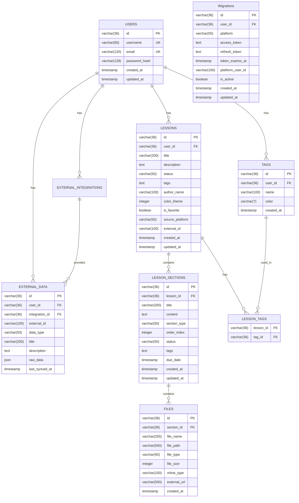

# Database ER Diagram - Smart Learning Hub

## 📊 **Entity Relationship Diagram**



## 🔗 **ความสัมพันธ์ระหว่าง Entities**

### 1. **Users (ผู้ใช้)**
- **One-to-Many** กับ Lessons (ผู้ใช้ 1 คน มีบทเรียนได้หลายบท)
- **One-to-Many** กับ External Integrations (ผู้ใช้ 1 คน เชื่อมต่อ platform ได้หลายตัว)
- **One-to-Many** กับ Tags (ผู้ใช้ 1 คน สร้างแท็กได้หลายแท็ก)
- **One-to-Many** กับ External Data (ผู้ใช้ 1 คน มีข้อมูลจากภายนอกได้หลายชุด)

### 2. **Lessons (บทเรียน)**
- **Many-to-One** กับ Users (บทเรียนหลายบท อยู่ในผู้ใช้ 1 คน)
- **One-to-Many** กับ Lesson Sections (บทเรียน 1 บท มีส่วนได้หลายส่วน)
- **Many-to-Many** กับ Tags ผ่าน Lesson Tags (บทเรียน 1 บท มีแท็กได้หลายแท็ก)

### 3. **Lesson Sections (ส่วนของบทเรียน)**
- **Many-to-One** กับ Lessons (ส่วนหลายส่วน อยู่ในบทเรียน 1 บท)
- **One-to-Many** กับ Files (ส่วน 1 ส่วน มีไฟล์ได้หลายไฟล์)

### 4. **Files (ไฟล์)**
- **Many-to-One** กับ Lesson Sections (ไฟล์หลายไฟล์ อยู่ในส่วน 1 ส่วน)

### 5. **External Integrations (การเชื่อมต่อภายนอก)**
- **Many-to-One** กับ Users (การเชื่อมต่อหลายตัว อยู่ในผู้ใช้ 1 คน)
- **One-to-Many** กับ External Data (การเชื่อมต่อ 1 ตัว ให้ข้อมูลได้หลายชุด)

### 6. **External Data (ข้อมูลจากภายนอก)**
- **Many-to-One** กับ Users (ข้อมูลหลายชุด อยู่ในผู้ใช้ 1 คน)
- **Many-to-One** กับ External Integrations (ข้อมูลหลายชุด มาจากการเชื่อมต่อ 1 ตัว)

### 7. **Tags (แท็ก)**
- **Many-to-One** กับ Users (แท็กหลายแท็ก อยู่ในผู้ใช้ 1 คน)
- **Many-to-Many** กับ Lessons ผ่าน Lesson Tags (แท็ก 1 แท็ก ใช้ในบทเรียนได้หลายบท)

## 📈 **ข้อดีของการออกแบบนี้**

### 1. **Normalization ที่ดี**
- แยกข้อมูลเป็น tables ที่เหมาะสม
- ลด data redundancy
- ง่ายต่อการ query และ update

### 2. **Scalability**
- รองรับข้อมูลจำนวนมาก
- Indexes ที่เหมาะสม
- Query performance ที่ดี

### 3. **Flexibility**
- รองรับหลาย platform
- ง่ายต่อการเพิ่ม features ใหม่
- JSON field สำหรับข้อมูลที่ซับซ้อน

### 4. **Maintainability**
- โครงสร้างที่เข้าใจง่าย
- Consistent naming convention
- Clear relationships ระหว่าง tables

## 🔧 **ตัวอย่าง Queries ที่ใช้บ่อย**

### 1. **ดึงบทเรียนทั้งหมดของผู้ใช้**
```sql
SELECT * FROM lessons WHERE user_id = ? ORDER BY created_at DESC;
```

### 2. **ดึงบทเรียนพร้อมแท็ก**
```sql
SELECT l.*, GROUP_CONCAT(t.name) as tag_names
FROM lessons l
LEFT JOIN lesson_tags lt ON l.id = lt.lesson_id
LEFT JOIN tags t ON lt.tag_id = t.id
WHERE l.user_id = ?
GROUP BY l.id;
```

### 3. **ดึงบทเรียนจาก Google Classroom**
```sql
SELECT * FROM lessons 
WHERE user_id = ? AND source_platform = 'google_classroom';
```

### 4. **ดึงไฟล์ทั้งหมดของบทเรียน**
```sql
SELECT f.* FROM files f
JOIN lesson_sections ls ON f.section_id = ls.id
WHERE ls.lesson_id = ?;
```

### 5. **ดึงข้อมูลจากภายนอก**
```sql
SELECT * FROM external_data 
WHERE user_id = ? AND data_type = 'course';
``` 