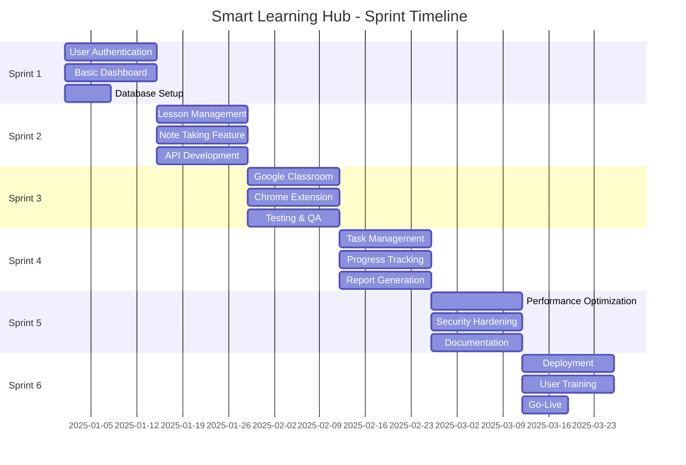
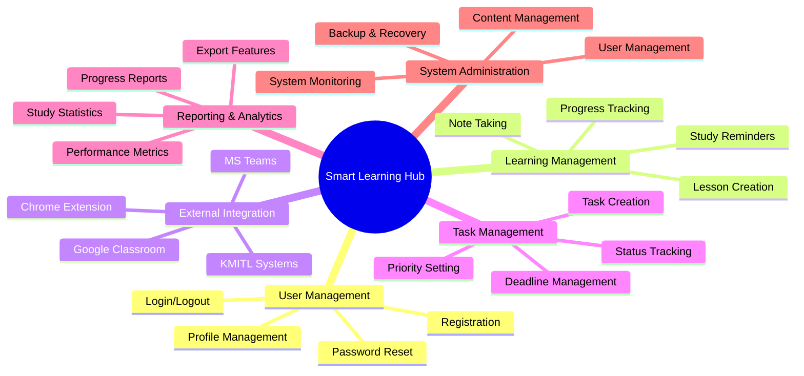

# **Smart Learning Hub - SDLC Agile Model Kanban Diagram**

## **Kanban Board Visualization**

### **Main Kanban Board**

```mermaid
graph TB
    subgraph "📋 Product Backlog"
        PB1[User Authentication System]
        PB2[Lesson Management Module]
        PB3[Note Taking Feature]
        PB4[Google Classroom Integration]
        PB5[Chrome Extension Development]
        PB6[Task Management System]
        PB7[Progress Tracking]
        PB8[Report Generation]
        PB9[Testing & Quality Assurance]
        PB10[Documentation & Deployment]
    end

    subgraph "🔄 Sprint Planning"
        SP1[Prioritize User Stories]
        SP2[Estimate Story Points]
        SP3[Define Sprint Goals]
        SP4[Create Sprint Backlog]
    end

    subgraph "📝 To Do"
        TD1[Design User Interface]
        TD2[Implement Authentication]
        TD3[Create Database Schema]
        TD4[Develop API Endpoints]
        TD5[Integrate Google APIs]
        TD6[Build Chrome Extension]
        TD7[Write Unit Tests]
        TD8[Perform Code Review]
    end

    subgraph "⚡ In Progress"
        IP1[Frontend Development]
        IP2[Backend API Development]
        IP3[Database Integration]
        IP4[External API Integration]
        IP5[Chrome Extension Coding]
        IP6[Testing Implementation]
    end

    subgraph "🧪 Testing"
        T1[Unit Testing]
        T2[Integration Testing]
        T3[User Acceptance Testing]
        T4[Performance Testing]
        T5[Security Testing]
        T6[Cross-browser Testing]
    end

    subgraph "✅ Done"
        D1[User Registration System]
        D2[Login/Authentication]
        D3[Basic Dashboard]
        D4[Lesson CRUD Operations]
        D5[Note Management]
        D6[Google Classroom Sync]
        D7[Chrome Extension MVP]
        D8[Basic Documentation]
    end

    %% Flow connections
    PB1 --> SP1
    PB2 --> SP1
    PB3 --> SP1
    PB4 --> SP1
    PB5 --> SP1
    
    SP1 --> SP2
    SP2 --> SP3
    SP3 --> SP4
    SP4 --> TD1
    
    TD1 --> IP1
    TD2 --> IP2
    TD3 --> IP3
    TD4 --> IP2
    TD5 --> IP4
    TD6 --> IP5
    TD7 --> IP6
    TD8 --> IP6
    
    IP1 --> T1
    IP2 --> T2
    IP3 --> T2
    IP4 --> T3
    IP5 --> T4
    IP6 --> T5
    
    T1 --> D1
    T2 --> D2
    T3 --> D3
    T4 --> D4
    T5 --> D5
    T6 --> D6

    %% Styling
    classDef backlog fill:#fff3e0,stroke:#e65100,stroke-width:2px
    classDef planning fill:#e8f5e8,stroke:#1b5e20,stroke-width:2px
    classDef todo fill:#e3f2fd,stroke:#0277bd,stroke-width:2px
    classDef progress fill:#fff8e1,stroke:#f57f17,stroke-width:2px
    classDef testing fill:#f3e5f5,stroke:#4a148c,stroke-width:2px
    classDef done fill:#e8f5e8,stroke:#1b5e20,stroke-width:2px

    class PB1,PB2,PB3,PB4,PB5,PB6,PB7,PB8,PB9,PB10 backlog
    class SP1,SP2,SP3,SP4 planning
    class TD1,TD2,TD3,TD4,TD5,TD6,TD7,TD8 todo
    class IP1,IP2,IP3,IP4,IP5,IP6 progress
    class T1,T2,T3,T4,T5,T6 testing
    class D1,D2,D3,D4,D5,D6,D7,D8 done
```



## **Sprint Timeline View**



## **Agile Process Flow**

```mermaid
flowchart TD
    subgraph "🎯 Product Vision"
        PV[Product Vision]
        PV --> PB[Product Backlog]
    end
    
    subgraph "📋 Sprint Planning"
        PB --> SP[Sprint Planning]
        SP --> SB[Sprint Backlog]
        SB --> SG[Sprint Goals]
    end
    
    subgraph "🔄 Sprint Execution"
        SG --> TD[To Do]
        TD --> IP[In Progress]
        IP --> T[Testing]
        T --> D[Done]
    end
    
    subgraph "📊 Sprint Review"
        D --> SR[Sprint Review]
        SR --> DR[Demo & Feedback]
        DR --> PB2[Updated Product Backlog]
    end
    
    subgraph "🔄 Sprint Retrospective"
        SR --> RET[Sprint Retrospective]
        RET --> IMP[Process Improvements]
        IMP --> SP2[Next Sprint Planning]
    end
    
    %% Continuous flow
    PB2 --> SP2
    SP2 --> SB2[Sprint Backlog 2]
    SB2 --> TD2[To Do 2]
    
    %% Styling
    classDef vision fill:#e8f5e8,stroke:#1b5e20,stroke-width:3px
    classDef planning fill:#e3f2fd,stroke:#0277bd,stroke-width:2px
    classDef execution fill:#fff8e1,stroke:#f57f17,stroke-width:2px
    classDef review fill:#f3e5f5,stroke:#4a148c,stroke-width:2px
    classDef retrospective fill:#fff3e0,stroke:#e65100,stroke-width:2px
    
    class PV,PB vision
    class SP,SB,SG planning
    class TD,IP,T,D execution
    class SR,DR,PB2 review
    class RET,IMP,SP2 retrospective
```



## **WIP Limits & Metrics**

```mermaid
graph LR
    subgraph "📊 Kanban Metrics"
        subgraph "🎯 WIP Limits"
            WIP1[To Do: 8 items]
            WIP2[In Progress: 6 items]
            WIP3[Testing: 4 items]
            WIP4[Done: Unlimited]
        end
        
        subgraph "📈 Key Metrics"
            M1[Lead Time: 5-7 days]
            M2[Cycle Time: 3-5 days]
            M3[Throughput: 8-12 items/sprint]
            M4[Velocity: 25-35 story points]
        end
        
        subgraph "🚨 Blockers & Dependencies"
            B1[External API Delays]
            B2[Third-party Integration Issues]
            B3[Testing Environment Setup]
            B4[Code Review Bottlenecks]
        end
    end
    
    %% Connections
    WIP1 --> M1
    WIP2 --> M2
    WIP3 --> M3
    WIP4 --> M4
    
    M1 --> B1
    M2 --> B2
    M3 --> B3
    M4 --> B4
    
    %% Styling
    classDef wip fill:#e1f5fe,stroke:#01579b,stroke-width:2px
    classDef metrics fill:#f3e5f5,stroke:#4a148c,stroke-width:2px
    classDef blockers fill:#ffebee,stroke:#c62828,stroke-width:2px
    
    class WIP1,WIP2,WIP3,WIP4 wip
    class M1,M2,M3,M4 metrics
    class B1,B2,B3,B4 blockers
```



## **User Story Mapping**



## **Definition of Done Checklist**

```mermaid
graph TD
    subgraph "✅ Definition of Done"
        subgraph "📝 Development"
            D1[Code Written]
            D2[Code Reviewed]
            D3[Unit Tests Pass]
            D4[Integration Tests Pass]
        end
        
        subgraph "🧪 Testing"
            T1[Manual Testing Done]
            T2[Automated Tests Added]
            T3[Performance Tested]
            T4[Security Tested]
        end
        
        subgraph "📚 Documentation"
            DOC1[Code Documented]
            DOC2[API Documented]
            DOC3[User Guide Updated]
            DOC4[README Updated]
        end
        
        subgraph "🚀 Deployment"
            DEP1[Deployed to Staging]
            DEP2[Staging Tests Pass]
            DEP3[Deployed to Production]
            DEP4[Production Verified]
        end
    end
    
    %% Flow
    D1 --> D2 --> D3 --> D4
    D4 --> T1 --> T2 --> T3 --> T4
    T4 --> DOC1 --> DOC2 --> DOC3 --> DOC4
    DOC4 --> DEP1 --> DEP2 --> DEP3 --> DEP4
    
    %% Styling
    classDef dev fill:#e8f5e8,stroke:#1b5e20,stroke-width:2px
    classDef test fill:#fff8e1,stroke:#f57f17,stroke-width:2px
    classDef doc fill:#e3f2fd,stroke:#0277bd,stroke-width:2px
    classDef deploy fill:#f3e5f5,stroke:#4a148c,stroke-width:2px
    
    class D1,D2,D3,D4 dev
    class T1,T2,T3,T4 test
    class DOC1,DOC2,DOC3,DOC4 doc
    class DEP1,DEP2,DEP3,DEP4 deploy
```



## **Sprint Burndown Chart**

```mermaid
graph LR
    subgraph "📊 Sprint Burndown"
        subgraph "Day 1"
            D1_1[40 Story Points]
            D1_2[8 Tasks Remaining]
        end
        
        subgraph "Day 3"
            D3_1[32 Story Points]
            D3_2[6 Tasks Remaining]
        end
        
        subgraph "Day 5"
            D5_1[24 Story Points]
            D5_2[4 Tasks Remaining]
        end
        
        subgraph "Day 7"
            D7_1[16 Story Points]
            D7_2[3 Tasks Remaining]
        end
        
        subgraph "Day 10"
            D10_1[8 Story Points]
            D10_2[1 Task Remaining]
        end
        
        subgraph "Day 14"
            D14_1[0 Story Points]
            D14_2[0 Tasks Remaining]
        end
    end
    
    %% Progress flow
    D1_1 --> D3_1 --> D5_1 --> D7_1 --> D10_1 --> D14_1
    D1_2 --> D3_2 --> D5_2 --> D7_2 --> D10_2 --> D14_2
    
    %% Styling
    classDef day1 fill:#ffebee,stroke:#c62828,stroke-width:2px
    classDef day3 fill:#fff3e0,stroke:#e65100,stroke-width:2px
    classDef day5 fill:#fff8e1,stroke:#f57f17,stroke-width:2px
    classDef day7 fill:#e8f5e8,stroke:#1b5e20,stroke-width:2px
    classDef day10 fill:#e1f5fe,stroke:#01579b,stroke-width:2px
    classDef day14 fill:#f3e5f5,stroke:#4a148c,stroke-width:2px
    
    class D1_1,D1_2 day1
    class D3_1,D3_2 day3
    class D5_1,D5_2 day5
    class D7_1,D7_2 day7
    class D10_1,D10_2 day10
    class D14_1,D14_2 day14
```



---

## **Usage Instructions**

### **1. GitHub/GitLab**
```markdown
```mermaid
[โค้ด Mermaid จากด้านบน]
```
```

### **2. Notion**
- ใช้ Mermaid plugin
- Copy-paste โค้ดลงใน code block

### **3. Documentation Sites**
- **GitBook:** รองรับ Mermaid natively
- **ReadTheDocs:** ใช้ Mermaid extension
- **Docusaurus:** ใช้ @docusaurus/theme-mermaid

### **4. Presentation Tools**
- **Reveal.js:** ใช้ Mermaid plugin
- **Marp:** รองรับ Mermaid
- **PowerPoint:** Export จาก Mermaid Live Editor

### **5. Web Development**
```html
<script src="https://cdn.jsdelivr.net/npm/mermaid/dist/mermaid.min.js"></script>
<script>
    mermaid.initialize({ startOnLoad: true });
</script>
<div class="mermaid">
    [โค้ด Mermaid]
</div>
```

---

**หมายเหตุ:** โค้ด Mermaid เหล่านี้แสดง SDLC Agile Model Kanban ที่ครบถ้วน ตั้งแต่ Product Backlog, Sprint Planning, Development, Testing, ไปจนถึง Deployment และ Monitoring 