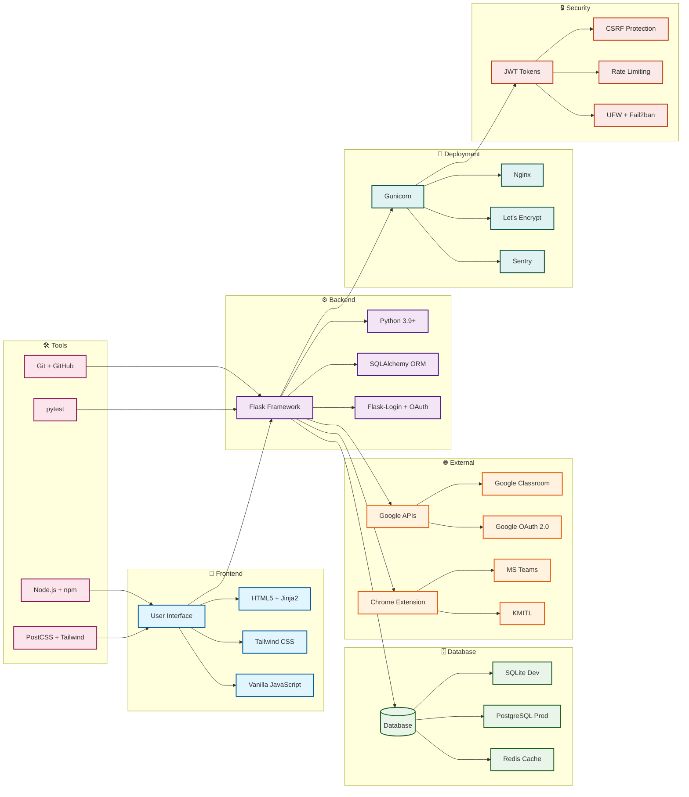
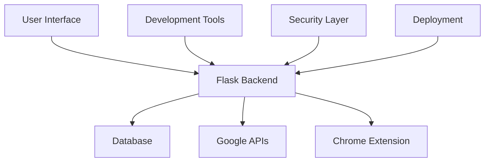
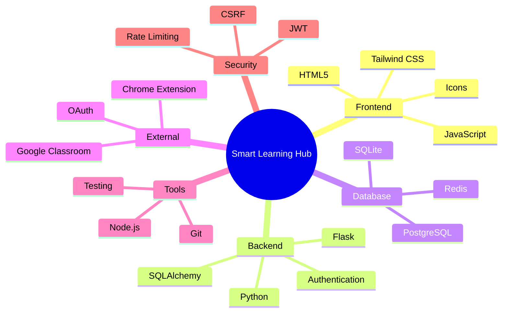
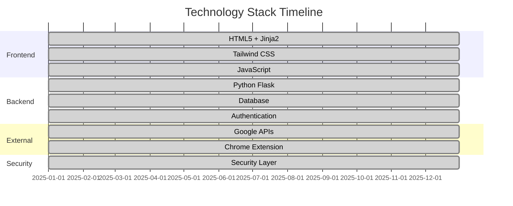

# **Smart Learning Hub - Technology Stack Diagram**

## **Enhanced Mermaid Diagram Code**

```mermaid
graph TB
    %% User Interface Layer
    subgraph "🎨 Frontend Layer"
        UI[User Interface]
        UI --> HTML[HTML5 + Jinja2]
        UI --> CSS[Tailwind CSS + Bootstrap]
        UI --> JS[Vanilla JavaScript]
        UI --> Icons[FontAwesome + Bootstrap Icons]
    end

    %% Application Layer
    subgraph "⚙️ Backend Layer"
        Flask[Flask Framework]
        Flask --> Python[Python 3.9+]
        Flask --> SQLAlchemy[SQLAlchemy ORM]
        Flask --> Auth[Flask-Login + OAuth]
        Flask --> WTF[Flask-WTF]
    end

    %% Database Layer
    subgraph "🗄️ Database Layer"
        DB[(Database)]
        DB --> SQLite[SQLite - Development]
        DB --> PostgreSQL[PostgreSQL - Production]
        DB --> Redis[Redis - Caching]
    end

    %% External Services
    subgraph "🌐 External Services"
        Google[Google APIs]
        Google --> Classroom[Google Classroom API]
        Google --> OAuth[Google OAuth 2.0]
        
        Chrome[Chrome Extension]
        Chrome --> MS[MS Teams Integration]
        Chrome --> KMITL[KMITL Integration]
    end

    %% Development Tools
    subgraph "🛠️ Development Tools"
        Git[Git + GitHub]
        Node[Node.js + npm]
        Build[PostCSS + Tailwind]
        Test[pytest + Flask-Testing]
    end

    %% Deployment & Infrastructure
    subgraph "🚀 Deployment & Infrastructure"
        Server[Gunicorn WSGI Server]
        Server --> Nginx[Nginx Reverse Proxy]
        Server --> SSL[Let's Encrypt SSL]
        Server --> Monitoring[Application Monitoring]
        Server --> Logs[Python Logging]
        Server --> Sentry[Sentry Error Tracking]
    end

    %% Security Layer
    subgraph "🔒 Security Layer"
        Security[JWT Tokens]
        Security --> CSRF[CSRF Protection]
        Security --> RateLimit[Rate Limiting]
        Security --> Firewall[UFW Firewall]
        Security --> Fail2ban[Fail2ban Protection]
    end

    %% Connections
    UI --> Flask
    Flask --> DB
    Flask --> Google
    Flask --> Chrome
    
    Git --> Flask
    Node --> UI
    Build --> UI
    Test --> Flask
    
    Flask --> Server
    Server --> Security
    
    %% Styling
    classDef frontend fill:#e1f5fe,stroke:#01579b,stroke-width:2px
    classDef backend fill:#f3e5f5,stroke:#4a148c,stroke-width:2px
    classDef database fill:#e8f5e8,stroke:#1b5e20,stroke-width:2px
    classDef external fill:#fff3e0,stroke:#e65100,stroke-width:2px
    classDef tools fill:#fce4ec,stroke:#880e4f,stroke-width:2px
    classDef deployment fill:#e0f2f1,stroke:#004d40,stroke-width:2px
    classDef security fill:#fbe9e7,stroke:#bf360c,stroke-width:2px

    class UI,HTML,CSS,JS,Icons frontend
    class Flask,Python,SQLAlchemy,Auth,WTF backend
    class DB,SQLite,PostgreSQL,Redis database
    class Google,Classroom,OAuth,Chrome,MS,KMITL external
    class Git,Node,Build,Test tools
    class Server,Gunicorn,Nginx,SSL,LetsEncrypt,Monitoring,Logs,Sentry deployment
    class Security,JWT,CSRF,RateLimit,Firewall,Fail2ban security
```



## **Alternative Layout: Horizontal Flow**



## **Simplified Architecture View**

```mermaid
graph TB
    %% Main Components
    subgraph "🎯 Smart Learning Hub Architecture"
        Frontend[Frontend Layer]
        Backend[Backend Layer]
        Database[Database Layer]
        External[External Services]
        Security[Security Layer]
    end

    %% Frontend Details
    Frontend --> HTML[HTML5 + Jinja2]
    Frontend --> CSS[Tailwind CSS]
    Frontend --> JS[Vanilla JavaScript]
    Frontend --> Icons[FontAwesome Icons]

    %% Backend Details
    Backend --> Flask[Flask Framework]
    Backend --> Python[Python 3.9+]
    Backend --> SQLAlchemy[SQLAlchemy ORM]
    Backend --> Auth[Flask-Login + OAuth]

    %% Database Details
    Database --> SQLite[SQLite - Development]
    Database --> PostgreSQL[PostgreSQL - Production]
    Database --> Redis[Redis - Caching]

    %% External Details
    External --> Google[Google Classroom API]
    External --> Chrome[Chrome Extension]
    External --> Teams[MS Teams Integration]
    External --> KMITL[KMITL Integration]

    %% Security Details
    Security --> JWT[JWT Tokens]
    Security --> CSRF[CSRF Protection]
    Security --> RateLimit[Rate Limiting]
    Security --> Firewall[UFW + Fail2ban]

    %% Development Tools
    subgraph "🛠️ Development Stack"
        Git[Git + GitHub]
        Node[Node.js + npm]
        Build[PostCSS + Tailwind]
        Test[pytest + Flask-Testing]
    end

    %% Deployment
    subgraph "🚀 Production Stack"
        Server[Gunicorn WSGI]
        Nginx[Nginx Reverse Proxy]
        SSL[Let's Encrypt SSL]
        Monitoring[Sentry Monitoring]
    end

    %% Connections
    Frontend --> Backend
    Backend --> Database
    Backend --> External
    Backend --> Security
    
    Git --> Backend
    Node --> Frontend
    Build --> Frontend
    Test --> Backend
    
    Backend --> Server
    Server --> Nginx
    Server --> SSL
    Server --> Monitoring

    %% Styling
    classDef main fill:#e3f2fd,stroke:#0277bd,stroke-width:3px
    classDef frontend fill:#e1f5fe,stroke:#01579b,stroke-width:2px
    classDef backend fill:#f3e5f5,stroke:#4a148c,stroke-width:2px
    classDef database fill:#e8f5e8,stroke:#1b5e20,stroke-width:2px
    classDef external fill:#fff3e0,stroke:#e65100,stroke-width:2px
    classDef security fill:#fbe9e7,stroke:#bf360c,stroke-width:2px
    classDef tools fill:#fce4ec,stroke:#880e4f,stroke-width:2px
    classDef deployment fill:#e0f2f1,stroke:#004d40,stroke-width:2px

    class Frontend,Backend,Database,External,Security main
    class HTML,CSS,JS,Icons frontend
    class Flask,Python,SQLAlchemy,Auth backend
    class SQLite,PostgreSQL,Redis database
    class Google,Chrome,Teams,KMITL external
    class JWT,CSRF,RateLimit,Firewall security
    class Git,Node,Build,Test tools
    class Server,Nginx,SSL,Monitoring deployment
```



## **Technology Stack Summary**

### **Frontend Technologies**
- **HTML5 + Jinja2:** Template engine for dynamic content
- **Tailwind CSS:** Utility-first CSS framework for responsive design
- **Vanilla JavaScript:** Modern ES6+ JavaScript for interactivity
- **FontAwesome + Bootstrap Icons:** Icon libraries for UI elements

### **Backend Technologies**
- **Python 3.9+:** Core programming language
- **Flask:** Lightweight web framework
- **SQLAlchemy:** Object-relational mapping (ORM)
- **Flask-Login:** User session management
- **Flask-WTF:** Form handling and CSRF protection

### **Database Technologies**
- **SQLite:** Development database (file-based)
- **PostgreSQL:** Production database (robust, scalable)
- **Redis:** Caching layer for performance optimization

### **External Integrations**
- **Google Classroom API:** Course and assignment synchronization
- **Google OAuth 2.0:** Secure authentication
- **Chrome Extension:** Data extraction from MS Teams/KMITL

### **Development Tools**
- **Git + GitHub:** Version control and collaboration
- **Node.js + npm:** Package management for frontend tools
- **PostCSS + Tailwind:** CSS build process
- **pytest + Flask-Testing:** Testing framework

### **Deployment & Infrastructure**
- **Gunicorn:** WSGI server for Python applications
- **Nginx:** Reverse proxy and static file serving
- **Let's Encrypt:** SSL certificate management
- **Python Logging:** Application monitoring
- **Sentry:** Error tracking and performance monitoring

### **Security Measures**
- **JWT Tokens:** Stateless authentication
- **CSRF Protection:** Cross-site request forgery prevention
- **Rate Limiting:** API abuse prevention
- **UFW Firewall:** Network security
- **Fail2ban:** Intrusion prevention

---

## **Usage Instructions**

### **1. GitHub/GitLab (Markdown)**
```markdown
# เพิ่มโค้ดนี้ในไฟล์ .md
```mermaid
[โค้ด Mermaid ข้างต้น]
```
```

### **2. Notion**
- ใช้ Mermaid plugin หรือ
- Copy-paste โค้ด Mermaid ลงใน code block

### **3. Documentation Sites**
- **GitBook:** รองรับ Mermaid natively
- **ReadTheDocs:** ใช้ Mermaid extension
- **Docusaurus:** ใช้ @docusaurus/theme-mermaid

### **4. Presentation Tools**
- **Reveal.js:** ใช้ Mermaid plugin
- **Marp:** รองรับ Mermaid
- **PowerPoint:** Export จาก Mermaid Live Editor

### **5. Web Development**
```html
<!-- ใช้ Mermaid.js ในเว็บไซต์ -->
<script src="https://cdn.jsdelivr.net/npm/mermaid/dist/mermaid.min.js"></script>
<script>
    mermaid.initialize({ startOnLoad: true });
</script>
<div class="mermaid">
    [โค้ด Mermaid ข้างต้น]
</div>
```

### **6. Online Mermaid Editor**
- ไปที่ [Mermaid Live Editor](https://mermaid.live/)
- Paste โค้ด Mermaid
- Export เป็น PNG, SVG, หรือ PDF

---

## **Alternative Diagram Styles**

### **Style 1: Flowchart (Vertical)**


### **Style 2: Mind Map**


### **Style 3: Timeline**


---

**หมายเหตุ:** โค้ด Mermaid เหล่านี้สามารถนำไปใช้ในเว็บไซต์ เอกสาร หรือ presentation ได้ทันที โดยไม่ต้องติดตั้งอะไรเพิ่มเติม (ยกเว้นการใช้งานในเว็บไซต์ที่ต้องโหลด Mermaid.js) 